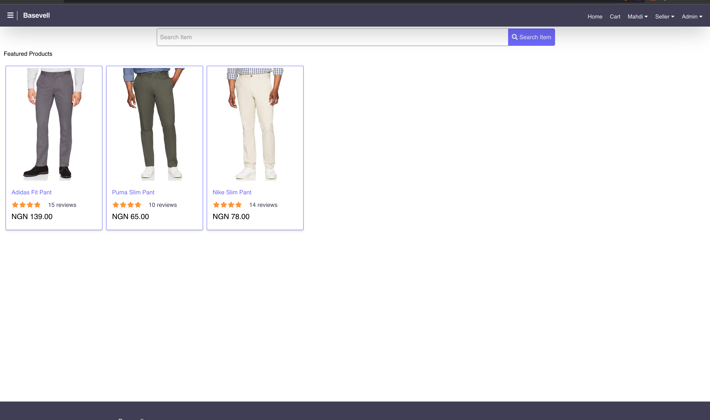

# Basevell - Shop At Ease

## Welcome! 👋

Thanks for checking out this e-commers project.

[Basevell](https://www.basevell.com) project help me improve my coding skills by building realistic projects.

**To do this project, you need a basic understanding of HTML and CSS.**

## The project

Your users should be able to:

- To add item to cart
- To sign up/sign in with there email address and password
- Be able to checkout the cart, proceed to buy the item
- Admin will see all the orders,
- Add products
- Add sellers and many more
- I recommend login with admin@admin.com as email address and 12345 as the password to see the admin panel

Want some support on the project? Google is the best resource

## Where to find everything

The designs are in JPG static format. Using JPGs will mean that you'll need to use your best judgment for styles such as `font-size`, `padding` and `margin`.

You will find all the required assets in the `/img` inside frontend folder. The assets are already optimized.

## Building your project

Feel free to use any workflow that you feel comfortable with. Below is a suggested process, but do not feel like you need to follow these steps:

1. Initialize your project as a public repository on [GitHub](https://github.com/). Creating a repo will make it easier to share your code with the community if you need help. If you're not sure how to do this, [have a read-through of this Try Git resource](https://try.github.io/).
2. Configure your repository to publish your code to a web address. This will also be useful if you need some help during a challenge as you can share the URL for your project with your repo URL. There are a number of ways to do this, and we provide some recommendations below.
3. Look through the designs to start planning out how you'll tackle the project. This step is crucial to help you think ahead for CSS classes to create reusable styles.
4. Before adding any styles, structure your content with HTML. Writing your HTML first can help focus your attention on creating well-structured content.
5. Write out the base styles for your project, including general content styles, such as `font-family` and `font-size`.
6. Start adding styles to the top of the page and work down. Only move on to the next section once you're happy you've completed the area you're working on.

## Deploying your project

This project is deploy to Heroku and domain from namecheap

- [Heroku](https://heroku.com/)
